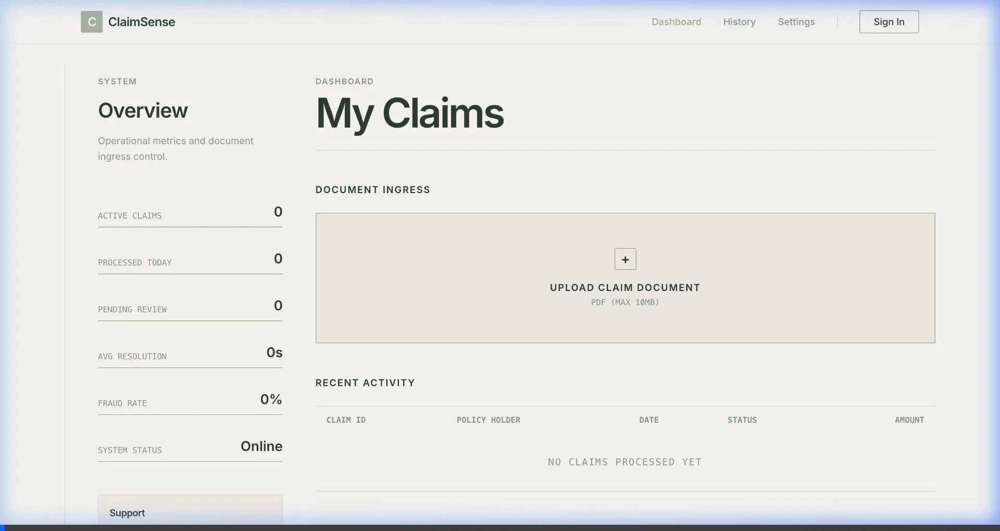

# ClaimSense AI



**ClaimSense** is a next-generation insurance claim processing platform designed with a "Swiss International" aesthetic. It leverages advanced AI to analyze claim documents in real-time, providing immediate risk assessment, data extraction, and cost analysis.

## Key Features

- **Objectively Beautiful UI**: A stark, "Swiss International / Braun" inspired design system. Pure white backgrounds, jet black typography, and strict grid alignment. No clutter, no beige.
- **AI-Powered Analysis**: Automatically extracts claimant data, policy numbers, and incident descriptions from PDF/Image uploads.
- **Intelligent Risk Assessment**: Detects fraud patterns and flags low/high-risk claims instantly.
- **Visual & Raw Data Modes**: Switch between a clean visual summary and raw JSON data for developers.
- **Responsive Layout**: A 12-column grid that adapts flawlessly from desktop to mobile.

## Technology Stack

- **Frontend**: Next.js 14, React, Tailwind CSS (Custom "Swiss" config), Framer Motion.
- **Backend**: Python, FastAPI.
- **AI Engine**: OpenAI GPT-4 / Gemini (Configurable).
- **Design System**: Custom implementation enforcing Grotesk typography (Inter) and high-contrast accessibility.

## Design Philosophy

The UI follows the **Swiss International Style** (International Typographic Style):

> "Perfection is achieved, not when there is nothing more to add, but when there is nothing left to take away." — Antoine de Saint-Exupéry

- **Palette**: `#FFFFFF` (White) & `#000000` (Black).
- **Typography**: **Inter** (Grotesk Sans-Serif). No serifs allowed.
- **Layout**: Mathematical grids, asymmetric organization, and clear hierarchy.

## Getting Started

### Prerequisites

- Node.js 18+
- Python 3.10+
- OpenAI API Key

### Installation

1.  **Clone the repository**
    ```bash
    git clone https://github.com/harshini090/insurance-claim-ai.git
    cd insurance-claim-ai
    ```

2.  **Setup Backend**
    ```bash
    cd backend
    pip install -r requirements.txt
    # Create .env with your AI keys
    poetry run python -m app.main
    ```

3.  **Setup Frontend**
    ```bash
    cd frontend
    npm install
    npm run dev
    ```

4.  **Access**
    Open `http://localhost:3000` to view the application.

## License

MIT
